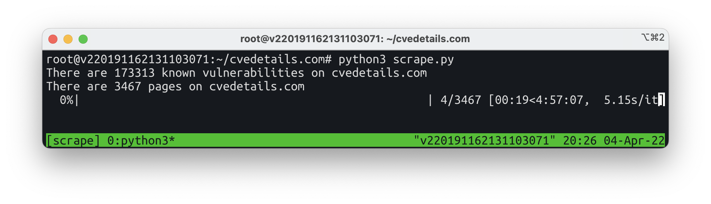

# cvedetails.com Scraper

Background story/problem statement:
CVE data were required in a quick and dirty way for large scale vulnerability analysis with exactly the data fields/format of https://cvedetails.com/. Manager was not happy with the CVE download provided by Mitre/cve.org due to parsing errors.

Step 1 - Install PIP Requirements
```
pip3 install -r requirements.txt
```

Step 2 - Scrape
```
python3 scrape_cvedetails.py
```



